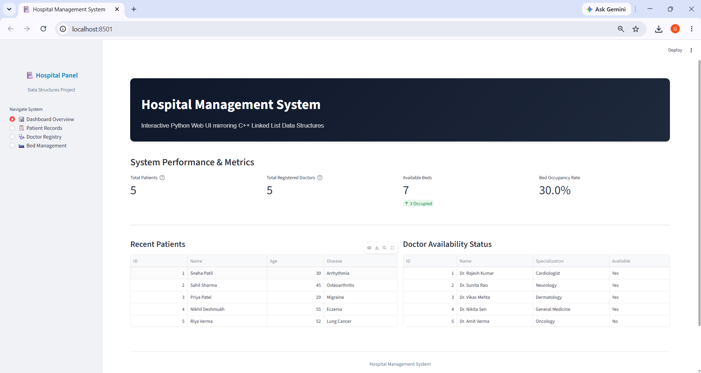
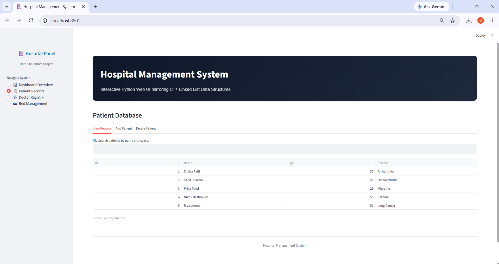
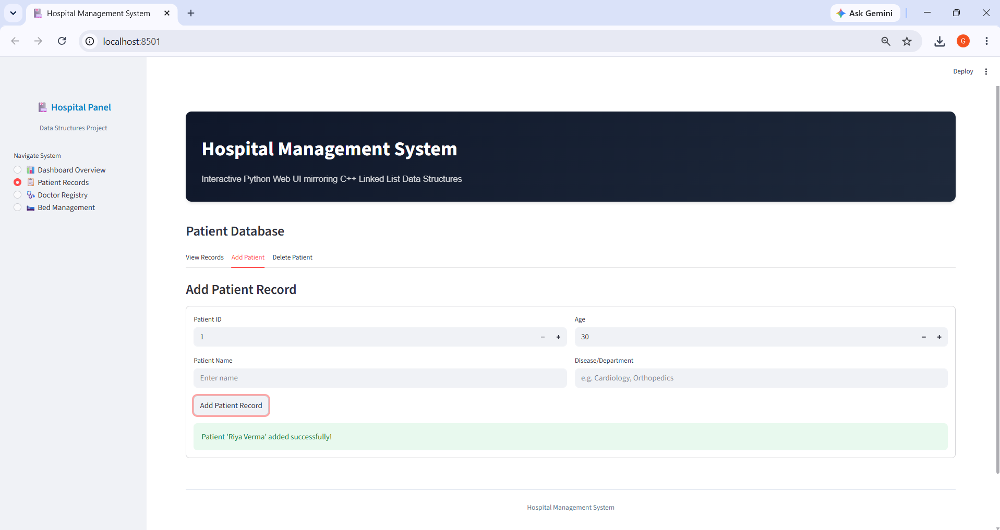
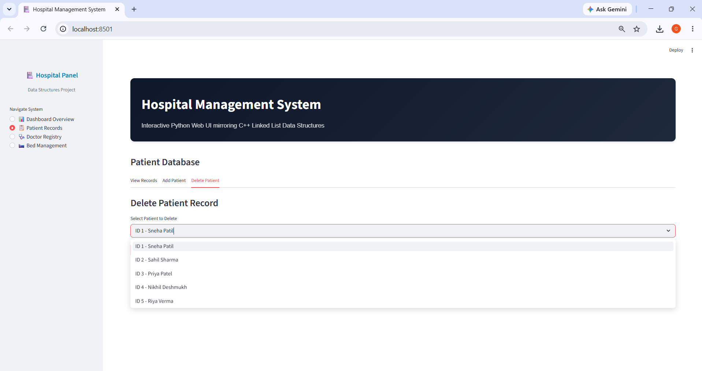
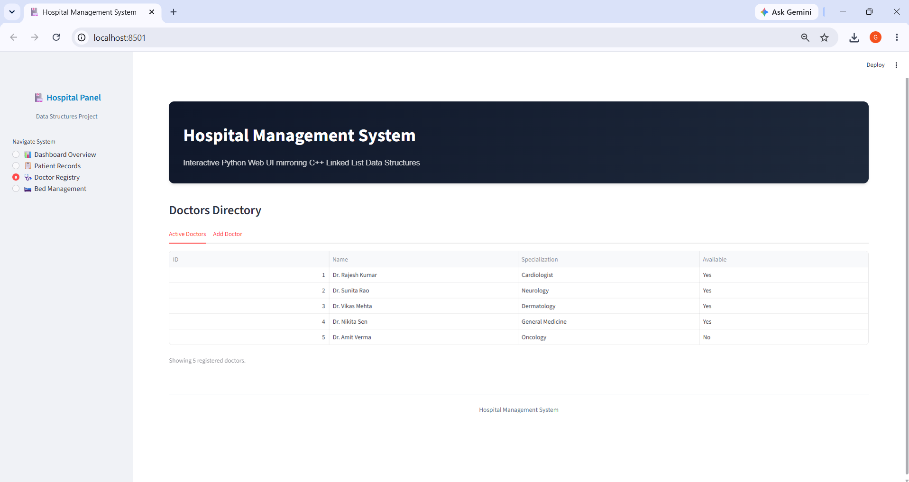
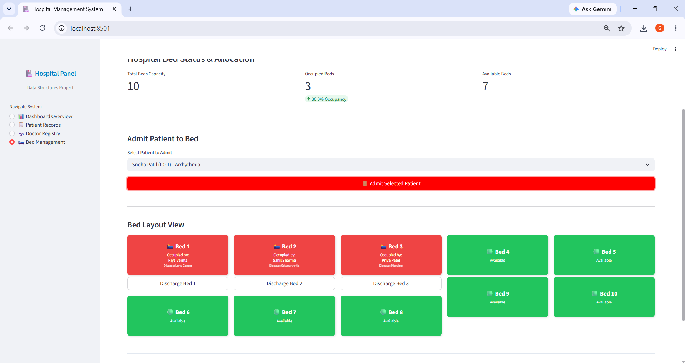
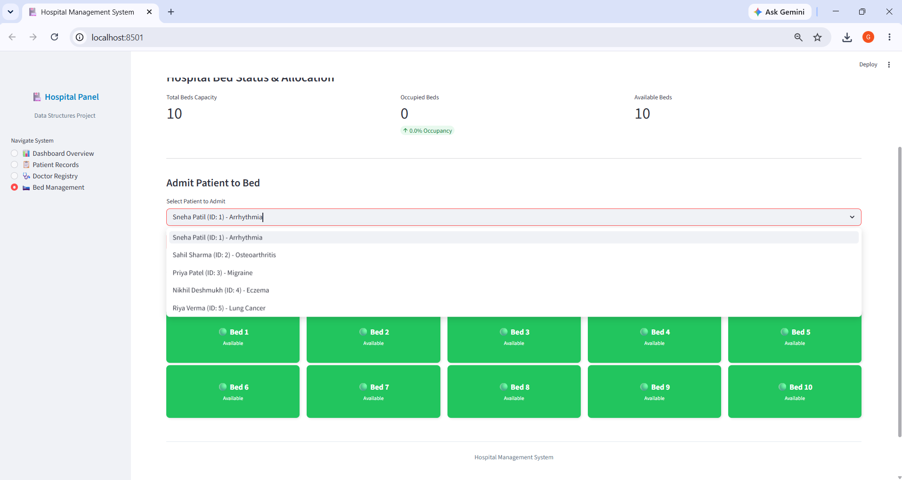
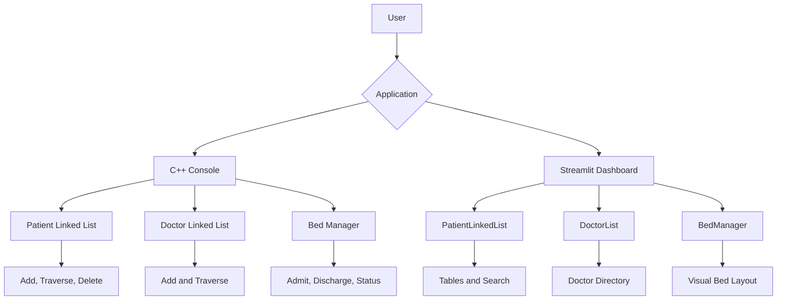

# Hospital Management System — DSA and Streamlit

A dual-implementation Hospital Management System demonstrating core **Data Structures and Algorithms** through a C++ console application and an interactive Python Streamlit dashboard.

The project uses custom **singly linked lists** to manage patient and doctor records, while also providing hospital bed allocation, searching, deletion, duplicate-ID validation, and visual reporting.

> **Academic notice:** This repository is an educational prototype created to demonstrate DSA and object-oriented programming. It must not be used for real medical records or clinical decisions.

## Key Features

- Patient management using a custom singly linked list
- Doctor registry using a custom singly linked list
- Add, display, search, and delete patient records
- Register doctors with specialization and availability
- Duplicate patient and doctor ID validation
- Hospital bed allocation and discharge management
- Bed occupancy metrics and visual status cards
- Interactive patient search by name or disease
- C++ console-based implementation
- Python Streamlit web dashboard
- Automated repository validation with GitHub Actions

## Application Screenshots

### Dashboard Overview



### Patient Database



### Add Patient



### Delete Patient



### Doctor Registry



### Bed Management



### Patient Admission



## System Architecture



## Data Structures Implemented

### Patient Singly Linked List

Each patient is stored in a dynamically created node containing:

- Patient ID
- Name
- Age
- Disease
- Pointer or reference to the next patient

Supported operations:

- Append a patient
- Traverse all patient records
- Search for an existing ID
- Delete a patient by ID
- Relink nodes after deletion

### Doctor Singly Linked List

Each doctor node contains:

- Doctor ID
- Name
- Specialization
- Availability
- Pointer or reference to the next doctor

Supported operations:

- Add a doctor
- Traverse the doctor list
- Validate unique doctor IDs
- Display availability information

### Bed Manager

The bed-management component maintains:

- Total bed capacity
- Occupied beds
- Available beds
- Patient assigned to each bed
- Admission and discharge status

## DSA Complexity

| Operation | Data Structure | Time Complexity |
|---|---|---:|
| Add patient | Singly linked list | O(n) |
| Display patients | Singly linked list | O(n) |
| Search patient ID | Singly linked list | O(n) |
| Delete patient | Singly linked list | O(n) |
| Add doctor | Singly linked list | O(n) |
| Display doctors | Singly linked list | O(n) |
| Search doctor ID | Singly linked list | O(n) |
| Find available bed | Bed collection | O(b) |
| Discharge by bed number | Bed collection | O(1) |

Here, `n` is the number of linked-list nodes and `b` is the number of hospital beds.

## Technology Stack

| Category | Technology |
|---|---|
| Console application | C++ |
| Web application | Python |
| Web framework | Streamlit |
| Data presentation | Pandas |
| Core DSA | Singly linked lists |
| Programming approach | Object-oriented programming |
| C++ compiler | GCC/G++ |
| Testing | Pytest |
| Continuous integration | GitHub Actions |

## Project Structure

```text
hospital-management-system-dsa/
├── .github/
│   └── workflows/
│       └── tests.yml
├── cpp/
│   └── hospital_management.cpp
├── screenshots/
│   ├── add_patient.png
│   ├── admit_patient_dropdown.png
│   ├── bed_management.png
│   ├── dashboard_overview.png
│   ├── delete_patient.png
│   ├── doctors_registry.png
│   └── patient_database.png
├── tests/
│   └── test_repository.py
├── .gitignore
├── app.py
├── requirements.txt
├── requirements-dev.txt
└── README.md
```

## Prerequisites

### For the C++ Application

- GCC/G++ compiler with C++11 support

### For the Streamlit Application

- Python 3.10 or newer
- `pip`
- Git

## Clone the Repository

```powershell
git clone https://github.com/kompalwargangotri/hospital-management-system-dsa.git
cd hospital-management-system-dsa
```

## Run the C++ Console Application

### Compile

```powershell
g++ -std=c++11 -Wall -Wextra -pedantic cpp/hospital_management.cpp -o hospital_management.exe
```

### Run on Windows

```powershell
.\hospital_management.exe
```

### Run on Linux or macOS

```bash
g++ -std=c++11 -Wall -Wextra -pedantic cpp/hospital_management.cpp -o hospital_management
./hospital_management
```

## Run the Streamlit Dashboard

### Create a Virtual Environment

```powershell
py -m venv .venv
```

### Activate It on Windows

```powershell
.\.venv\Scripts\Activate.ps1
```

### Install Dependencies

```powershell
python -m pip install --upgrade pip
python -m pip install -r requirements.txt
```

### Start the Application

```powershell
streamlit run app.py
```

The dashboard will normally open at:

```text
http://localhost:8501
```

## Application Modules

### Dashboard Overview

Displays:

- Total patient records
- Total registered doctors
- Available beds
- Bed occupancy rate
- Recent patient records
- Doctor availability

### Patient Records

Supports:

- Viewing the patient linked list
- Searching by patient name or disease
- Adding validated patient records
- Preventing duplicate patient IDs
- Deleting records by ID

### Doctor Registry

Supports:

- Viewing registered doctors
- Adding doctor profiles
- Recording specialization
- Recording availability
- Preventing duplicate doctor IDs

### Bed Management

Supports:

- Selecting a registered patient
- Assigning the first available bed
- Preventing duplicate admission
- Displaying occupied and available beds
- Discharging a patient by bed number
- Updating occupancy metrics automatically

## Testing

Install the development dependency:

```powershell
python -m pip install -r requirements-dev.txt
```

Run the tests:

```powershell
python -m pytest tests -v
```

The automated test suite validates:

- Required C++ linked-list structures
- Patient insertion and deletion logic
- Doctor and bed-management classes
- Python application syntax
- Streamlit linked-list implementation
- Expected screenshot files
- PNG signatures and image dimensions
- Exclusion of reports and compiled artifacts

## Continuous Integration

The GitHub Actions workflow automatically:

1. Checks out the repository.
2. Sets up Python.
3. Installs the test dependency.
4. Validates Python syntax.
5. Compiles the C++ application with warnings enabled.
6. Runs the complete Pytest suite.

The workflow runs for:

- Pull requests targeting `main`
- Pushes to `main`

## Security and Privacy

- The application uses fictional demonstration records.
- No passwords, API keys, or access tokens are required.
- Environment files and compiled executables are ignored.
- Original academic reports are excluded because they contain student identifiers.
- Real patient information must never be entered into this prototype.
- The system does not provide medical advice or clinical decision support.

## Limitations

- Application data is stored only in the current Streamlit session.
- Data is reset when the Streamlit session restarts.
- The C++ implementation does not use persistent storage.
- Linked-list searches require linear time.
- Authentication and role-based access are not implemented.
- The system is not designed for production hospital environments.

## Future Improvements

- Add persistent SQLite or PostgreSQL storage
- Add patient and doctor update operations
- Add appointment scheduling
- Add authentication and role-based access
- Add billing and pharmacy modules
- Add linked-list tail pointers for O(1) insertion
- Connect bed assignments directly to patient IDs
- Add C++ unit tests
- Package the application with Docker
- Deploy the Streamlit dashboard publicly

## Repository

[Hospital Management System — DSA](https://github.com/kompalwargangotri/hospital-management-system-dsa)

## Author

**Gangotri Kompalwar**

- GitHub: [kompalwargangotri](https://github.com/kompalwargangotri)

- LinkedIn: [Gangotri Kompalwar](https://www.linkedin.com/in/gangotri-kompalwar-4635b9359)
